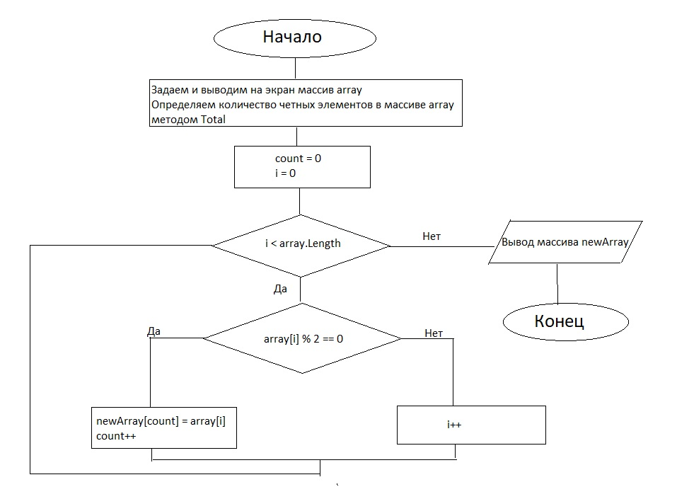

# __Итоговая проверочная работа.__

*Задача:* 

Написать программу, которая из имеющегося массива целых чисел формирует массив из четных чисел. Первоначальный массив можно ввести с клавиатуры, либо сгенерировать случайным образом. При решении не рекомендуется пользоваться коллекциями, лучше обойтись исключительно массивами.

*Решение:*
1. Создаем блок-схему алгоритма решения задачи:
 

2. Описываем решение в файле ReadMe.md

3. Пишем программу:
+ Пишем метод FillArray, который создает массив
+ Пишем метод PrintArray, котрый выводит созданный массив на экран
+ Пишем метод NewArray, который выбирает четные числа в напечатенном массиве

4. Выгружаем репозиторий на GitHub
